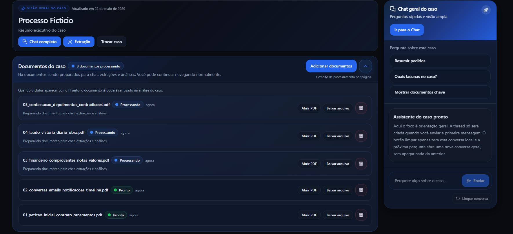
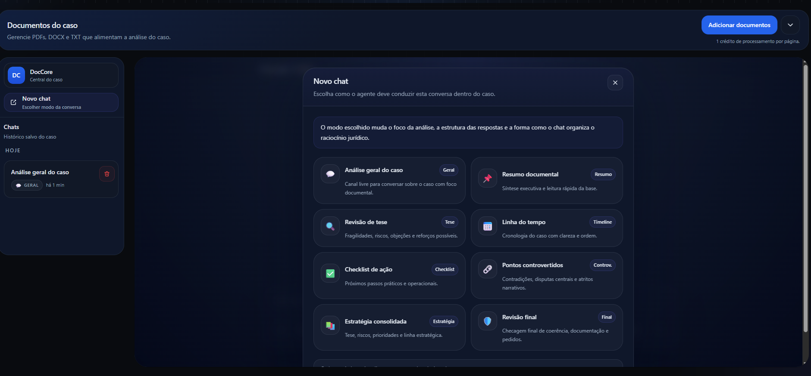
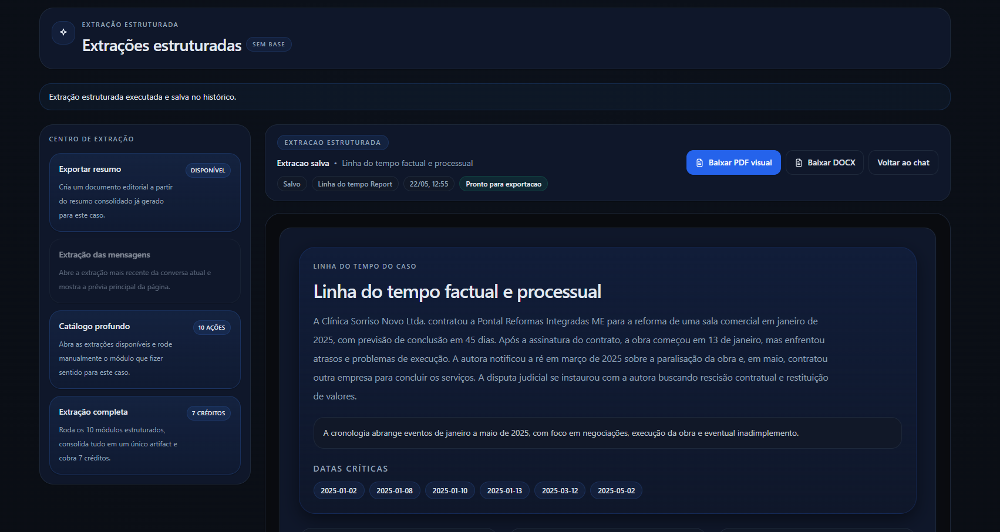
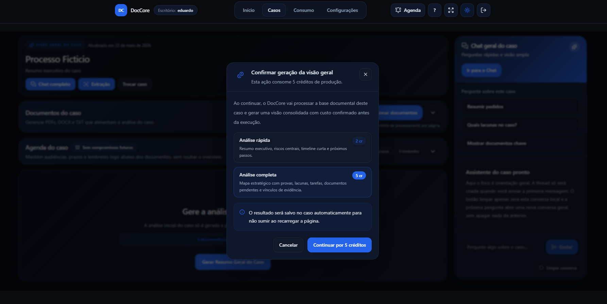
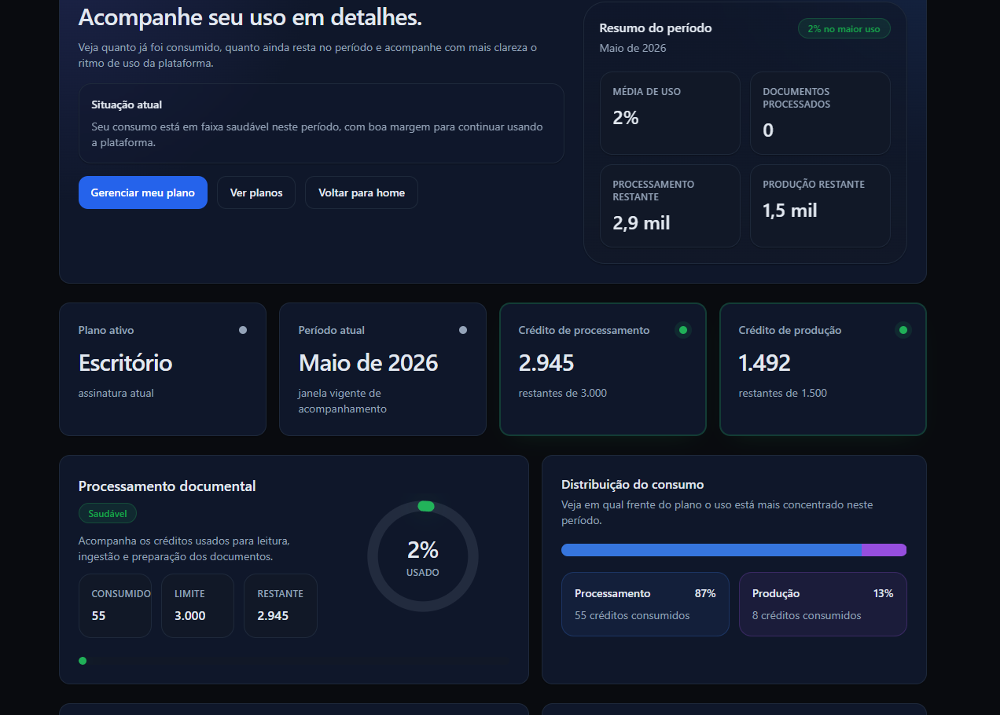

# DocCore — AI Document Intelligence System

DocCore is an AI-powered document intelligence platform that transforms unstructured documents into structured, searchable knowledge using Retrieval-Augmented Generation (RAG), scalable backend pipelines, and multi-tenant SaaS architecture.

It is designed as both a production-grade SaaS system and a system design case study for modern AI infrastructure.

---

## What DocCore Does

DocCore converts raw documents into structured intelligence through an end-to-end AI pipeline:

- Document ingestion and processing
- Semantic retrieval using embeddings
- Context-aware RAG chat systems
- AI-generated structured artifacts
- Usage-based billing and tenant isolation

---

## Product Flow

### 1. Document Upload

Users upload documents into isolated tenant workspaces.

---

### 2. Ingestion Pipeline

Documents are processed asynchronously:

- Extraction
- Text normalization
- Semantic blocking
- Embedding generation
- Vector indexing (pgvector)

---

### 3. AI Understanding Layer

The system generates structured intelligence:

- Document summaries
- Insights
- Context metadata

#### Summary — Part 1

#### Summary — Part 2

---

### 4. Retrieval-Augmented Chat

Users interact with documents via:

- Lightweight overview chat (fast responses)
- Full RAG chat with thread-based memory

**Overview Chat (fast mode):**

**Deep RAG Chat (full system):**

---

### 5. Artifact Generation

The system produces structured AI outputs that can be downloaded and reused.

---

### 6. Usage & Billing

All operations are tracked using a credit-based billing system per tenant.

**Billing example:**

**User usage dashboard:**

---

## Key Capabilities

- Retrieval-Augmented Generation (RAG)
- Semantic search over document embeddings
- Multi-tenant data isolation
- Asynchronous document processing pipeline
- AI-generated structured artifacts
- Credit-based usage tracking
- Context-aware conversational interfaces

---

## Architecture Overview

DocCore is built around a retrieval-first AI architecture.

Core components:

- FastAPI backend
- Async worker-based ingestion (RQ + Redis)
- PostgreSQL + pgvector for vector storage
- Multi-tenant relational data model
- Decoupled processing pipeline for scalability

---

## Engineering Deep Dive

### Retrieval Strategy

DocCore uses embedding-based semantic retrieval as its core intelligence layer.

Key concepts:

- Vector similarity search
- Top-K retrieval
- Context ranking
- Tenant-scoped filtering
- Context assembly for LLM prompting

---

### RAG Pipeline

Document Upload → Extraction → Blocking → Embeddings → Vector Store → Retrieval → Context Assembly → LLM Response

---

### Multi-Tenant Architecture

DocCore enforces strict tenant isolation at every layer:

- Document ownership scoped per tenant
- Retrieval queries tenant-filtered
- Embedding search isolated per workspace
- Billing and usage tracked per tenant

---

### Security Model

- JWT authentication with HttpOnly cookies
- Tenant-scoped access control
- File upload validation
- Restricted document formats
- Server-side permission enforcement

---

### Usage & Billing

Credit-based system:

- Credits consumed per processing operation
- Separate tracking for ingestion and production usage
- Tenant-level usage ledger
- Subscription-based quotas

---

### Engineering Decisions

**PostgreSQL + pgvector**
- unified relational + vector storage
- simpler infrastructure

**RQ Workers**
- async ingestion pipeline
- decoupled processing

**Sync backend design**
- simpler operational model
- stable worker integration

---

## Limitations

- Retrieval ranking still evolving
- Hybrid retrieval not fully implemented
- Embedding strategy experimentation ongoing
- Worker orchestration could evolve to event-driven design

---

## Future Improvements

- Hybrid retrieval (keyword + vector)
- Advanced reranking models
- Event-driven ingestion pipeline
- Enhanced observability
- Better long-context handling

---

## Status

Active development — evolving into production-grade AI SaaS architecture.
