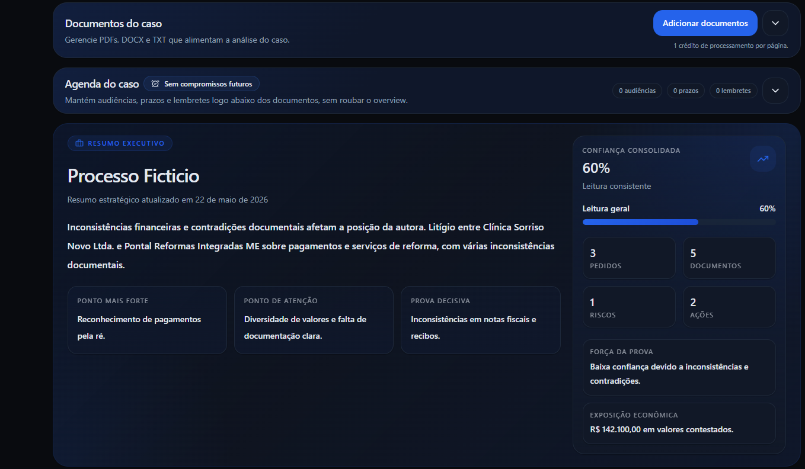
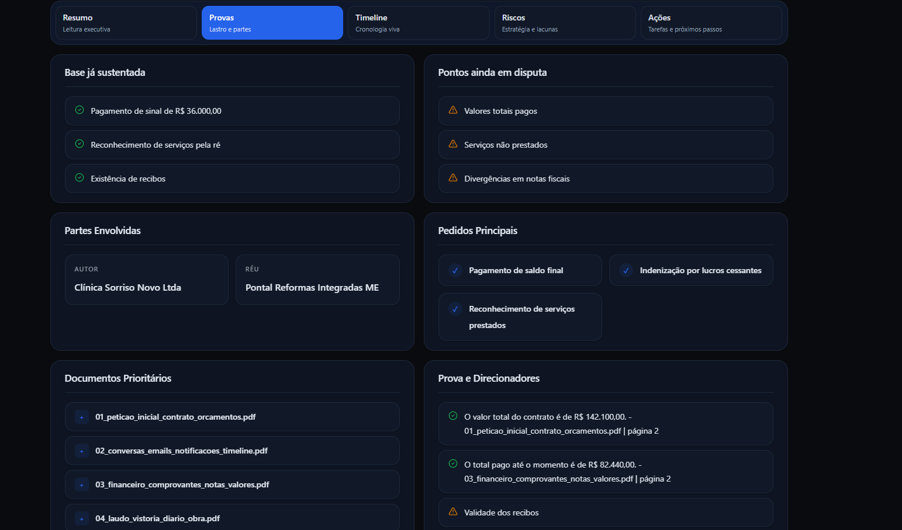

# DocCore — AI Document Intelligence Platform

DocCore is a production-oriented AI document intelligence platform designed to transform unstructured files into searchable, contextualized knowledge systems using Retrieval-Augmented Generation (RAG), semantic retrieval pipelines, and scalable multi-tenant infrastructure.

The platform combines modern AI orchestration, asynchronous processing pipelines, vector retrieval systems, and SaaS-grade tenant isolation into a unified document intelligence architecture.

---

# Overview

Traditional documents are static.

DocCore converts them into dynamic AI knowledge systems capable of:

* semantic retrieval
* contextual AI conversations
* structured intelligence extraction
* artifact generation
* scalable multi-document understanding

The platform is designed both as a real-world SaaS architecture and as a system design study for modern AI infrastructure engineering.

---

# Core Capabilities

* Retrieval-Augmented Generation (RAG)
* Semantic vector search
* Multi-tenant document isolation
* Asynchronous ingestion pipelines
* Context-aware conversational retrieval
* AI-generated structured artifacts
* Credit-based billing architecture
* Scalable worker-based processing
* Tenant-scoped vector retrieval
* Production-oriented backend infrastructure

---

# Product Workflow

## 1. Document Ingestion

Users upload documents into isolated tenant workspaces.

The platform validates, stores, and queues files for asynchronous processing.


---

## 2. AI Processing Pipeline

Uploaded documents pass through a multi-stage ingestion architecture:

* text extraction
* normalization
* semantic chunking
* embedding generation
* vector indexing
* metadata enrichment

The ingestion layer is fully decoupled using asynchronous workers.


---

## 3. Intelligence Generation

DocCore transforms raw document content into structured intelligence layers.

Generated outputs include:

* AI summaries
* contextual metadata
* semantic insights
* retrieval-ready context structures

### Summary Example — Part 1



### Summary Example — Part 2



---

## 4. Retrieval-Augmented Conversations

The platform supports multiple retrieval interaction modes.

### Lightweight Overview Chat

Optimized for fast contextual responses over processed documents.


### Full RAG Conversational System

Supports retrieval-aware contextual conversations with persistent thread memory and semantic context assembly.


---

## 5. Structured Artifact Generation

DocCore can generate reusable AI artifacts from processed knowledge contexts.

Examples include:

* structured reports
* contextual summaries
* reusable AI outputs
* exported intelligence artifacts


---

## 6. Usage Tracking & Billing

The platform includes a tenant-scoped credit billing architecture designed for AI operation metering.

Tracked operations include:

* ingestion costs
* embedding generation
* retrieval usage
* production AI operations

### Billing Example


### Usage Dashboard


---

# System Architecture

DocCore is built around a retrieval-first AI architecture optimized for scalability, tenant isolation, and asynchronous document intelligence workflows.

## High-Level Flow

```text
Client Application
        ↓
FastAPI API Layer
        ↓
Application Services
        ↓
Document Processing Pipeline
        ↓
Worker Queue System
        ↓
Embedding + Vector Storage
        ↓
Retrieval Orchestration
        ↓
LLM Context Assembly
        ↓
AI Response Generation
```

---

# Technical Stack

## Backend

* FastAPI
* SQLAlchemy
* PostgreSQL
* pgvector
* Redis
* RQ Workers

## Frontend

* Next.js
* TailwindCSS
* App Router architecture

## Infrastructure

* Docker Compose
* Async worker architecture
* Multi-tenant relational modeling
* Vector similarity retrieval

---

# Retrieval Architecture

Semantic retrieval is the core intelligence layer of the platform.

Key retrieval concepts implemented:

* embedding-based similarity search
* tenant-scoped retrieval isolation
* Top-K contextual retrieval
* semantic chunk ranking
* contextual prompt assembly
* retrieval-aware response generation

---

# RAG Pipeline

```text
Document Upload
    ↓
Extraction
    ↓
Normalization
    ↓
Semantic Chunking
    ↓
Embedding Generation
    ↓
pgvector Indexing
    ↓
Retrieval Layer
    ↓
Context Assembly
    ↓
LLM Response
```

---

# Multi-Tenant Design

DocCore enforces strict tenant isolation across all platform layers.

Isolation strategies include:

* tenant-scoped document ownership
* isolated retrieval queries
* vector filtering per workspace
* tenant-level billing ledgers
* scoped authentication contexts

The platform is designed for SaaS scalability from the ground up.

---

# Security Model

* JWT authentication with HttpOnly cookies
* tenant-scoped authorization
* server-side permission enforcement
* upload validation pipeline
* restricted document formats
* isolated retrieval boundaries

---

# Billing Architecture

The platform implements a credit-based AI billing model.

Usage is tracked independently across multiple AI operation categories:

* ingestion credits
* processing credits
* production credits
* retrieval operations

This architecture enables predictable SaaS monetization and tenant-level usage control.

---

# Engineering Decisions

## PostgreSQL + pgvector

Chosen to unify relational and vector storage into a single operational database layer.

Benefits:

* reduced infrastructure complexity
* transactional consistency
* simplified deployment
* easier tenant modeling

---

## Redis Queue + RQ Workers

Used to decouple ingestion workloads from synchronous API operations.

Benefits:

* async processing
* pipeline scalability
* workload isolation
* fault-tolerant ingestion flows

---

## Retrieval-First Architecture

The platform prioritizes retrieval quality as the foundation of AI accuracy.

This design enables:

* contextual grounding
* scalable document understanding
* lower hallucination rates
* retrieval-aware generation

---

# Production-Oriented Concerns

The platform includes architectural considerations commonly found in real-world SaaS systems:

* asynchronous ingestion pipelines
* worker-based processing
* vector retrieval orchestration
* usage metering
* tenant isolation
* scalable backend layering
* retrieval lifecycle management
* AI operation tracking
* modular infrastructure design

---

# Current Limitations

* hybrid retrieval is still evolving
* reranking systems are experimental
* long-context optimization is ongoing
* retrieval ranking quality continues improving
* orchestration is currently queue-based rather than event-driven

---

# Future Roadmap

* hybrid retrieval (BM25 + vector search)
* advanced reranking pipelines
* event-driven ingestion architecture
* observability and tracing
* streaming retrieval responses
* advanced retrieval caching
* multi-model orchestration
* long-context optimization
* distributed ingestion scaling

---

# Project Status

Actively evolving into a production-grade AI document intelligence SaaS platform focused on scalable retrieval systems, AI infrastructure engineering, and document-centric intelligence workflows.
